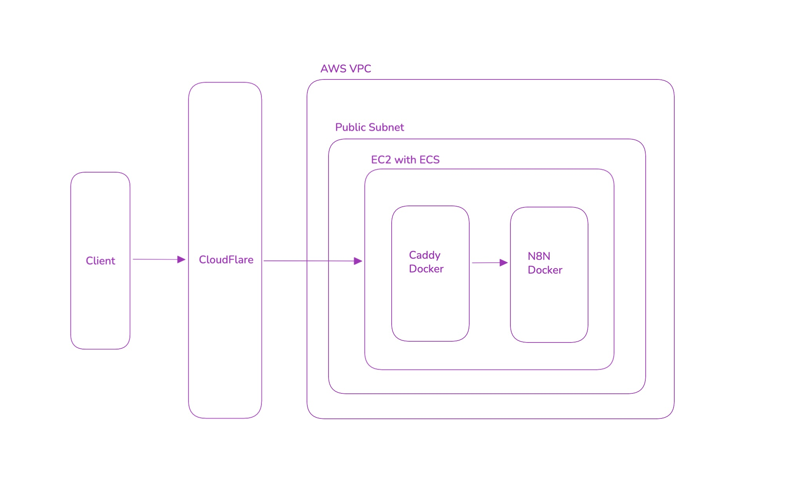

# Infrastructure

Highlights:
- N8N on AWS using single EC2 with Docker (Caddy for SSL + n8n). 
- SSL termination with Cloudflare. Origin server cert from Cloudflare.
- HTTPS only with Cloudflare IP whitelist.
- SSH whitelist from home IP.
- Cloudflare DNS A record for n8n subdomain using EC2 static IP.

## Technologies

- **AWS** – VPC, EC2
- **OpenTofu** – IaC (`tofu` CLI)
- **CloudFlare** - DNS, SSL

## Setup

Before running OpenTofu: create `infra/certs/` with your TLS files, and set required variables in `terraform.tfvars` (or another `*.tfvars` file). Do not commit `certs/` or real `*.tfvars`; both are in `.gitignore`.

### Certs

OpenTofu reads your local cert files and embeds them (base64) in the EC2 user_data. At first boot the instance writes them to `/opt/certs` and Caddy uses them for TLS.

**File layout** (under `infra/certs/`):

| File | Meaning |
|------|---------|
| `certificate.pem` | Cloudflare origin certificate body |
| `chain.pem` | Certificate chain |
| `private.key` | Private key for the origin cert |

Create the origin cert in Cloudflare: **SSL/TLS** → **Origin Server** → **Create Certificate**. Save the certificate, private key, and chain to the paths above. Paths can be overridden with `cert_body_path`, `cert_chain_path`, and `cert_private_key_path` (defaults are `certs/certificate.pem`, `certs/chain.pem`, `certs/private.key`).

### Variables

Set these in `terraform.tfvars` (or your chosen `*.tfvars` file).

**Required (AWS / access):**

| Variable | Meaning |
|----------|---------|
| `ec2_keypair_name` | Name of the EC2 key pair used for SSH |
| `home_ip_cidr` | Your IP in CIDR form (e.g. `1.2.3.4/32`) so the security group allows SSH only from you |

**Cloudflare (DNS A record for EC2):**

| Variable | Meaning |
|----------|---------|
| `cloudflare_api_token` | API token with DNS edit on the zone (sensitive) |
| `cloudflare_zone_id` | Zone ID from Cloudflare dashboard → zone Overview |
| `cloudflare_a_record_name` | Record name, e.g. `n8n` for n8n.example.com, or `@` for apex |

**n8n (app config, sensitive):**

| Variable | Meaning |
|----------|---------|
| `n8n_basic_auth_user` | Basic auth username (default `"admin"`) |
| `n8n_basic_auth_password` | Basic auth password (required, sensitive) |
| `n8n_encryption_key` | Key used by n8n for encrypting credentials (required, sensitive) |
| `n8n_basic_auth_active` | Whether to enable HTTP basic auth (default `true`) |
| `n8n_timezone` | Timezone for n8n (default `"America/New_York"`) |

## Run

From `infra/`:

```bash
tofu init
tofu plan
tofu apply
```

Outputs: `ec2_instance_id`, `ec2_elastic_ip`, `ec2_public_ip`, `ec2_public_dns`. The instance has an Elastic IP attached (static); use it for the DNS A record and SSH: `ssh -i your-key.pem ec2-user@<ec2_elastic_ip>`.

## Networking diagram


